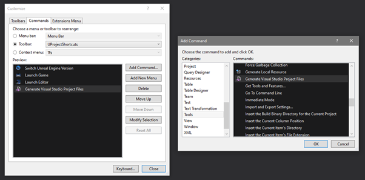

# Table of contents
- [Overview](#overview)
- [What is included](#what-is-included)
- [How to use it](#how-to-use-it)
- [Tested on](#tested-on)
- [Other references](#other-references)

# Overview

This software makes available a selection of Visual Studio commands that can be added to your toolbar

# What is included

There are 4 commands found in the "Tools" command section:

- Tools/
   - Switch Unreal Engine Version
   - Launch Game
   - Launch Editor
  - Generate Visual Studio Project Files

# How to use it

To install.
1. Click the "Add or remove buttons"
2. Click "Customize"

  
  
3. Click on the "Toolbars" tab
4. Click "New" and add a name. It can be anything. For example: "UProjectShortcuts"

  

5. Click on the "Commands" tab
6. In the "Toolbar" dropdown, choose "UProjectShortcuts", or whatever you called it
7. Click "Add Command"
8. Find the following Commands in the list. They are found under the "Tools" section. You will need to add these one by one until all have been added.
   - Tools/
      - Switch Unreal Engine Version
      - Launch Game
      - Launch Editor
      - Generate Visual Studio Project Files

  

9. Click Okay
10. Click Close
11. Restart Visual Studio

  

The commands will only work in an Unreal Engine project

# Tested on

| UE version | VS version |
| - | - |
| UE 4.26 | VS 2019 Community Edition |

# Other references
- Marketplace: https://marketplace.visualstudio.com/items?itemName=Naotsun.Naotsun-UE-US
